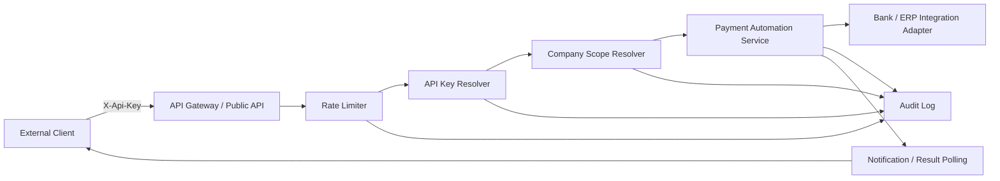

# Architecture Overview

## Problem Context

External API integrations in FinTech payment automation require more than exposing endpoints. A public API must identify the calling organization, restrict data to the owning company, preserve auditability, limit abuse, and provide predictable operational behavior when integrations fail.

This document describes a public-safe reference architecture for these concerns. It does not describe a private implementation or production system.

## Reference Architecture Overview

The architecture uses an API gateway or public API layer, API key resolution, company-scoped access, payment automation services, integration adapters, audit logging, rate limiting, and result notification or polling.

The main design principle is that the caller does not decide its company scope. The platform resolves the API key to an owning company and applies that scope to all downstream reads and commands.

## Design Assumptions

This architecture assumes a system-to-system integration model where external clients need predictable API access but should not receive broad platform-level permissions.

The design also assumes that company or tenant boundaries must be enforced by the platform, not by trusting request parameters. In practice, this means the API key is treated as both a credential and an ownership signal.

The architecture is intentionally conservative. It prefers explicit ownership resolution, centralized scope enforcement, auditability, and early rate limiting over scattered authorization checks inside individual endpoints.

## Main Components

- External Client: Third-party or partner system calling the public API.
- API Gateway / Public API: Entry point for validation, routing, and request controls.
- API Key Resolver: Validates the submitted token and resolves ownership metadata.
- Company Scope Resolver: Applies the owning company scope to the request.
- Payment Automation Service: Coordinates payment-related workflow commands and queries.
- Bank/ERP Integration Adapter: Encapsulates external provider or back-office integration.
- Audit Log: Records security and operational events without storing sensitive payloads.
- Rate Limiter: Applies per-token and per-company usage controls.
- Notification / Result Polling Component: Provides asynchronous result delivery or status lookup.

## Request Lifecycle

1. External client sends a request with `X-Api-Key`.
2. Public API validates request shape and required headers.
3. Rate limiter checks token and company usage limits.
4. API Key Resolver validates the token hash and status.
5. Company Scope Resolver resolves the owning company.
6. Application service executes the command or query inside that company scope.
7. Integration adapter performs provider-specific work through a stable abstraction.
8. Audit log records the decision, status, and operational metadata.
9. Response is returned directly or exposed later through notification or polling.

## Security Boundaries

- API keys are treated as credentials and stored only as hashes.
- Caller-supplied company identifiers are not trusted for authorization.
- All returned data is scoped by resolved token ownership.
- Audit logs avoid full credentials, secrets, and sensitive payloads.
- Rate limits are applied before expensive workflow execution.
- Revoked or expired tokens are rejected consistently.

## Operational Concerns

- Token rotation and revocation
- Audit log retention
- Rate limit thresholds
- Alerting for repeated failures
- Replay or abuse detection
- Idempotency for write operations
- Result polling for asynchronous workflows
- Safe error responses that do not leak internal details

## Text-Based Architecture Diagram

